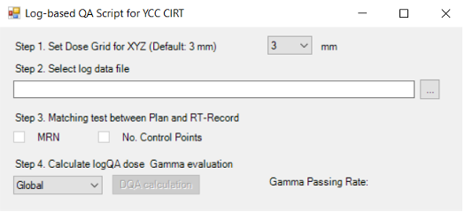

# LogQA_for_CIRT

This repository contains a program developed using RayStation scripting programming for performing Log-Based Patient-Specific Quality Assurance (QA) in carbon-ion radiation therapy. The program analyzes log files generated by radiation therapy delivery systems to verify the accuracy and precision of the treatment delivery process for individual patients.

Table of Contents

1. Introduction
2. Features
3. Requirements
4. Installation
5. Usage
6. License

## Introduction

The Log-Based Patient-Specific Quality Assurance (QA) program is designed to assess the quality of radiation therapy treatment plans by analyzing the log files generated during the delivery of radiation to the patient. With developed program, Delivered dose distributions is re-calculated with the treatment parameters (i.g. delivered spot positions and MU per spots) from the recorded log data. The program helps ensure that the radiation treatment is delivered accurately and precisely according to the treatment plan.

This program has been developed using RayStation scripting programming, which is a powerful tool for automation and customization within the RayStation treatment planning system. It utilizes Python libraries and modules to process and analyze the log files, providing valuable insights into the treatment delivery process.

## Features

- **Log File Parsing:** The program parses log files generated by radiation therapy delivery systems and extracts relevant treatment information.  
- **Data Analysis:** It analyzes the extracted log data to calculate various metrics, such as dose delivery accuracy, and monitor unit verification.  
- **Comparison with Treatment Plan:** The program compares the log data with the treatment plan parameters to ensure that the treatment delivery matches the intended plan in terms of gamma evaluations and spot position differences.  

## Requirements

To run this program, you need the following:

RayStation 11B was tested.  
Required Python libraries (specified in the requirements.txt file; pydicom, pymedphys, numpy, scipy))

## Installation

Clone this repository to your local machine or download the source code as a ZIP file.  
Install the required Python libraries by running the following command:  
`pip install -r requirements.txt`

## Usage
- Open the RayStation scripting programming environment.  
- Load the program file (LogQA_for_CIRT_*.py) into the scripting environment.  
- Modify the program parameters and settings as needed for your specific QA requirements.  
- Run the program by executing the main script.

- After log data is loaded, click the DQA calculation button.

## License

This program is licensed under the MIT License. Feel free to modify, distribute, and use it in your projects.  

--- 

A research paper is currently being prepared for publication on the application and validation of this program. The paper will be added once it is published.
